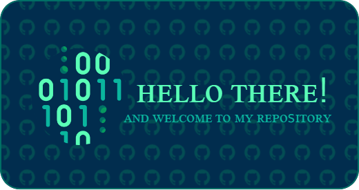

  

<h1 align="center"> 
  Hi there, I'm Valentin 
</h1>
<h3 align="center">Computer science student</h3>

### 🛠 Tools & Technologies
- 
- 
- 
- 

<!--
### 🔥 Лучшие проекты:
- [Проект 1](https://github.com/ТВОЙ_НИК/проект1) - Краткое описание
- [Проект 2](https://github.com/ТВОЙ_НИК/проект2) - Краткое описание

### 🔧 Основные технологии:
- 🐍 Python | Java | C++
- 📦 Docker | Git & GitHub | Qt Designer
- 🌐 HTML | CSS | SQL (Основы)

### 📬 Связь со мной:

-->

<!--
**vk-overlord/vk-overlord** is a ✨ _special_ ✨ repository because its `README.md` (this file) appears on your GitHub profile.

Here are some ideas to get you started:

- 🔭 I’m currently working on ...
- 🌱 I’m currently learning ...
- 👯 I’m looking to collaborate on ...
- 🤔 I’m looking for help with ...
- 💬 Ask me about ...
- 📫 How to reach me: ...
- 😄 Pronouns: ...
- ⚡ Fun fact: ...
-->
